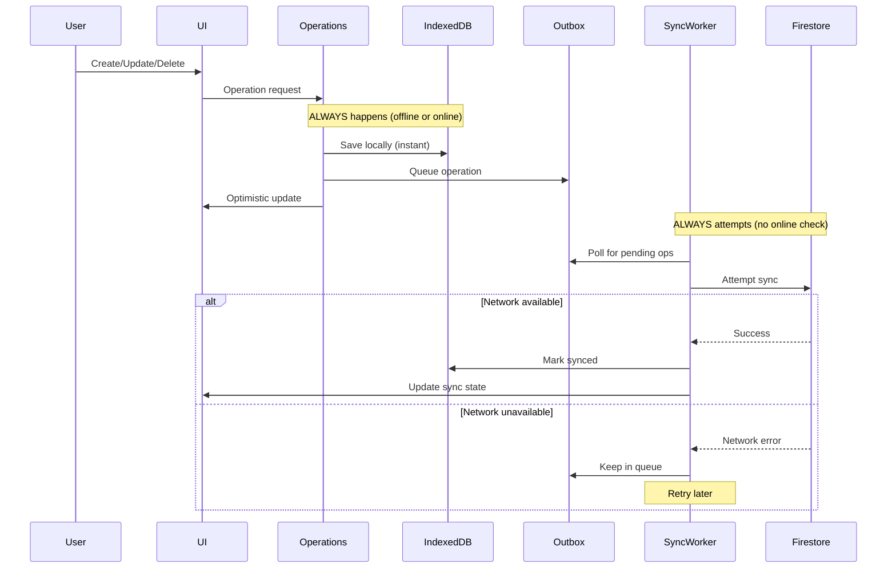

# Offline-First Architecture Migration Plan

# Offline-First Architecture Migration Plan

## Executive Summary

**Goal**: Migrate the entire LifeOS app to a pure offline-first architecture following the Notion approach - always write locally first, sync in background, never check online status before writing.

**Current State**: ~70% complete
- ✅ IndexedDB stores for todos, notes, calendar, training
- ✅ Outbox patterns with retry logic
- ✅ Sync workers with conflict resolution
- ✅ Optimistic UI updates
- ❌ Online checks blocking writes and sync attempts

**Target State**: 100% offline-first
- Always save locally immediately
- Always queue operations in outbox
- Always attempt sync (let network errors fail gracefully)
- Use online status only for UI indicators

---

## Architecture Overview



---

## Current Problems

### Problem 1: Operations Check Online Before Immediate Sync

**Location**: `file:apps/web-vite/src/hooks/useTodoOperations.ts`

**Lines**: 234, 259, 292, 317, 360, 407, 434

**Current Code**:
```typescript
// Try to sync immediately if online (don't block)
if (navigator.onLine) {
  todoRepository.saveTask(normalizedTask).catch((err) => {
    logger.error('Failed to sync task:', err)
  })
}
```

**Problem**: This prevents immediate sync attempts when offline, even though the error would be caught and handled gracefully.

**Impact**: 
- Delays sync until worker runs (up to 30 seconds)
- Inconsistent behavior between online/offline
- Unnecessary conditional logic

---

### Problem 2: Sync Workers Check Online Before Running

**Locations**:
- `file:apps/web-vite/src/todos/syncWorker.ts` (line 509)
- `file:apps/web-vite/src/notes/syncWorker.ts` (line 433)
- `file:apps/web-vite/src/outbox/worker.ts` (line 165)
- `file:apps/web-vite/src/training/syncWorker.ts` (line 193)

**Current Code**:
```typescript
// Don't sync if offline
if (!navigator.onLine) {
  console.log('Sync skipped - offline')
  return
}
```

**Problem**: Prevents sync attempts when offline, blocking the entire sync cycle.

**Impact**:
- No sync attempts when offline
- Relies on `navigator.onLine` which is unreliable
- Prevents graceful error handling
- Breaks offline-first principle

---

### Problem 3: Conditional Sync on Visibility Change

**Locations**:
- `file:apps/web-vite/src/todos/syncWorker.ts` (line 591)
- `file:apps/web-vite/src/notes/syncWorker.ts` (line 517)

**Current Code**:
```typescript
// Trigger immediate sync when page becomes visible
if (navigator.onLine) {
  syncTodos(userId).catch((error) => {
    console.error('Resume sync failed:', error)
  })
}
```

**Problem**: Checks online status before syncing when page becomes visible.

**Impact**: Misses opportunity to sync when user returns to app while offline.

---

## Migration Strategy

### Phase 1: Remove Online Checks from Operations (Low Risk)

**Files to Modify**:
- `file:apps/web-vite/src/hooks/useTodoOperations.ts`

**Changes**:
1. Remove all `if (navigator.onLine)` checks before immediate sync attempts
2. Always attempt immediate sync (errors are already caught)
3. Keep the `.catch()` error handlers

**Before**:
```typescript
if (navigator.onLine) {
  todoRepository.saveTask(normalizedTask).catch((err) => {
    logger.error('Failed to sync task:', err)
  })
}
```

**After**:
```typescript
// Always attempt immediate sync - errors handled gracefully
todoRepository.saveTask(normalizedTask).catch((err) => {
  logger.error('Failed to sync task:', err)
  // Outbox will retry later
})
```

**Risk**: Low - errors are already caught, outbox already handles retries

---

### Phase 2: Remove Online Checks from Sync Workers (Medium Risk)

**Files to Modify**:
- `file:apps/web-vite/src/todos/syncWorker.ts`
- `file:apps/web-vite/src/notes/syncWorker.ts`
- `file:apps/web-vite/src/outbox/worker.ts`
- `file:apps/web-vite/src/training/syncWorker.ts`

**Changes**:
1. Remove `if (!navigator.onLine)` checks at start of sync functions
2. Remove `if (navigator.onLine)` checks before visibility change syncs
3. Let network errors fail naturally and be caught by existing error handlers
4. Keep retry logic and error handling

**Before** (`syncTodos` function):
```typescript
// Don't sync if offline
if (!navigator.onLine) {
  console.log('Sync skipped - offline')
  return
}
```

**After**:
```typescript
// Always attempt sync - network errors handled gracefully
// Removed online check - let sync attempt and fail naturally if offline
```

**Before** (visibility change handler):
```typescript
if (navigator.onLine) {
  syncTodos(userId).catch((error) => {
    console.error('Resume sync failed:', error)
  })
}
```

**After**:
```typescript
// Always attempt sync when page becomes visible
syncTodos(userId).catch((error) => {
  console.error('Resume sync failed:', error)
})
```

**Risk**: Medium - sync will attempt more frequently, but errors are already handled

---

### Phase 3: Centralize Network Status for UI Only (Low Risk)

**Current State**: Multiple hooks track `navigator.onLine` for UI:
- `file:apps/web-vite/src/hooks/useOutbox.ts`
- `file:apps/web-vite/src/hooks/useTodoSync.ts`
- `file:apps/web-vite/src/hooks/useNoteSync.ts`
- `file:apps/web-vite/src/hooks/useAttachmentsOffline.ts`
- `file:apps/web-vite/src/hooks/useFirestoreListener.ts`
- `file:apps/web-vite/src/components/SystemStatus.tsx`

**Recommendation**: Keep these as-is for now. They're used correctly for UI indicators only.

**Future Enhancement** (Optional): Create a centralized `useNetworkStatus` hook:

```typescript
// file:apps/web-vite/src/hooks/useNetworkStatus.ts
export function useNetworkStatus() {
  const [isOnline, setIsOnline] = useState(navigator.onLine)
  const [connectionQuality, setConnectionQuality] = useState<'good' | 'poor' | 'offline'>('good')
  
  useEffect(() => {
    // Monitor online/offline events
    // Measure connection quality (latency, bandwidth)
    // Provide UI indicators
  }, [])
  
  return { isOnline, connectionQuality }
}
```

**Risk**: Low - this is purely additive and doesn't affect sync logic

---

## Detailed File Changes

### 1. `file:apps/web-vite/src/hooks/useTodoOperations.ts`

**Lines to Remove**: 230-234, 258-262, 291-295, 316-320, 359-363, 406-410, 433-437

**Pattern to Replace**:
```typescript
// REMOVE THIS:
if (navigator.onLine) {
  todoRepository.METHOD(...).catch((err) => {
    logger.error('Failed to sync ...:', err)
  })
}

// REPLACE WITH THIS:
todoRepository.METHOD(...).catch((err) => {
  logger.error('Failed to sync ...:', err)
  // Outbox will retry later
})
```

**Specific Changes**:

1. **createProject** (lines 230-234):
```typescript
// Remove the if (navigator.onLine) wrapper
todoRepository.saveProject(newProject).catch((err) => {
  logger.error('Failed to sync project:', err)
})
```

2. **deleteProject** (lines 258-262):
```typescript
todoRepository.deleteProject(userId, projectId).catch((err) => {
  logger.error('Failed to sync project deletion:', err)
})
```

3. **createChapter** (lines 291-295):
```typescript
todoRepository.saveChapter(newChapter).catch((err) => {
  logger.error('Failed to sync chapter:', err)
})
```

4. **deleteChapter** (lines 316-320):
```typescript
todoRepository.deleteChapter(userId, chapterId).catch((err) => {
  logger.error('Failed to sync chapter deletion:', err)
})
```

5. **createTask** (lines 359-363):
```typescript
todoRepository.saveTask(normalizedTask).catch((err) => {
  logger.error('Failed to sync task:', err)
})
```

6. **updateTask** (lines 406-410):
```typescript
todoRepository.saveTask(normalizedTask).catch((err) => {
  logger.error('Failed to sync task update:', err)
})
```

7. **deleteTask** (lines 433-437):
```typescript
todoRepository.deleteTask(userId, taskId).catch((err) => {
  logger.error('Failed to sync task deletion:', err)
})
```

---

### 2. `file:apps/web-vite/src/todos/syncWorker.ts`

**Changes**:

1. **Remove online check from `syncTodos` function** (lines 505-508):
```typescript
// REMOVE THESE LINES:
// Don't sync if offline
if (!navigator.onLine) {
  console.log('Sync skipped - offline')
  return
}

// The function should start directly with:
state.isRunning = true
```

2. **Remove online check from visibility handler** (lines 590-594):
```typescript
// BEFORE:
if (navigator.onLine) {
  syncTodos(userId).catch((error) => {
    console.error('Resume sync failed:', error)
  })
}

// AFTER:
syncTodos(userId).catch((error) => {
  console.error('Resume sync failed:', error)
})
```

---

### 3. `file:apps/web-vite/src/notes/syncWorker.ts`

**Changes**: Same pattern as todos/syncWorker.ts

1. **Remove online check from `syncNotes` function** (lines 429-432):
```typescript
// REMOVE THESE LINES:
// Don't sync if offline
if (!navigator.onLine) {
  console.log('Sync skipped - offline')
  return
}
```

2. **Remove online check from visibility handler** (lines 516-520):
```typescript
// BEFORE:
if (navigator.onLine) {
  syncNotes(userId).catch((error) => {
    console.error('Resume sync failed:', error)
  })
}

// AFTER:
syncNotes(userId).catch((error) => {
  console.error('Resume sync failed:', error)
})
```

---

### 4. `file:apps/web-vite/src/outbox/worker.ts`

**Changes**:

**Remove online check from `drainQueue` function** (lines 161-164):
```typescript
// REMOVE THESE LINES:
if (typeof globalThis.navigator !== 'undefined' && !globalThis.navigator.onLine) {
  logger.debug('Offline, skipping drain')
  return
}

// The function should continue directly to:
isDraining = true
```

**Rationale**: The `applyOp` function already has try-catch error handling. Network errors will be caught and operations will be marked as failed, then retried later.

---

### 5. `file:apps/web-vite/src/training/syncWorker.ts`

**Changes**:

1. **Remove `isOnline()` function** (lines 55-57):
```typescript
// REMOVE THIS ENTIRE FUNCTION:
function isOnline(): boolean {
  return typeof navigator !== 'undefined' ? navigator.onLine : true
}
```

2. **Remove online check from `drainTrainingOutbox`** (line 193):
```typescript
// BEFORE:
async function drainTrainingOutbox(userId: string): Promise<void> {
  if (!isOnline()) return
  const ops = await listReadyTrainingOps(userId)
  // ...
}

// AFTER:
async function drainTrainingOutbox(userId: string): Promise<void> {
  const ops = await listReadyTrainingOps(userId)
  // ...
}
```

---

### 6. `file:apps/web-vite/src/training/utils.ts`

**Changes**:

**Remove or deprecate `isOnline()` function** (lines 2-6):

**Option A - Remove entirely** (if not used elsewhere):
```typescript
// DELETE THIS FUNCTION
```

**Option B - Deprecate** (if used elsewhere):
```typescript
/**
 * @deprecated Do not use for sync logic. Only use for UI indicators.
 * Network status should not block operations.
 */
export function isOnline(): boolean {
  return typeof navigator !== 'undefined' ? navigator.onLine : true
}
```

---

## Benefits of This Migration

### 1. True Offline-First
- ✅ App works fully offline without special handling
- ✅ Instant feedback for all operations
- ✅ No "waiting for connection" errors
- ✅ Seamless online/offline transitions

### 2. Simpler Code
- ✅ Single code path (no "if online/else offline")
- ✅ Less branching = fewer bugs
- ✅ Easier to maintain and test
- ✅ Removed ~50 lines of conditional logic

### 3. Better UX
- ✅ Instant feedback for all operations
- ✅ No error states for basic operations
- ✅ Works offline without user noticing
- ✅ Automatic sync when connection restored

### 4. More Reliable
- ✅ Doesn't rely on `navigator.onLine` (unreliable)
- ✅ Graceful error handling
- ✅ Automatic retries
- ✅ Conflict resolution already in place

---

## Testing Strategy

### Unit Tests

**Test 1: Operations work offline**
```typescript
// Mock navigator.onLine = false
// Create/update/delete operations
// Verify: saved to IndexedDB
// Verify: queued in outbox
// Verify: UI updated optimistically
```

**Test 2: Sync workers attempt sync offline**
```typescript
// Mock navigator.onLine = false
// Trigger sync worker
// Verify: sync attempted
// Verify: network error caught
// Verify: operation remains in outbox
```

**Test 3: Sync succeeds when online**
```typescript
// Mock navigator.onLine = true
// Mock successful Firestore response
// Trigger sync worker
// Verify: operation synced
// Verify: marked as synced in IndexedDB
// Verify: removed from outbox
```

### Integration Tests

**Test 4: Offline → Online transition**
```typescript
// Start offline
// Create multiple operations
// Verify: all saved locally
// Go online
// Verify: all operations sync
// Verify: no duplicates
```

**Test 5: Flaky connection**
```typescript
// Simulate intermittent connection
// Create operations
// Verify: some sync, some retry
// Verify: all eventually sync
```

### Manual Testing Checklist

- [ ] Create todo offline → verify saved locally
- [ ] Go online → verify syncs automatically
- [ ] Create note offline → verify saved locally
- [ ] Create calendar event offline → verify saved locally
- [ ] Update task offline → verify optimistic update
- [ ] Delete task offline → verify removed from UI
- [ ] Check SystemStatus shows correct online/offline state
- [ ] Verify sync indicators update correctly
- [ ] Test with airplane mode on/off
- [ ] Test with slow 3G connection
- [ ] Verify no console errors when offline

---

## Rollback Plan

### If Issues Arise

**Step 1: Identify the problem**
- Check browser console for errors
- Check IndexedDB for data integrity
- Check outbox for stuck operations

**Step 2: Quick rollback**
- Revert the specific file causing issues
- Keep other changes in place
- Test incrementally

**Step 3: Full rollback** (if needed)
- Revert all changes using git
- Return to previous behavior
- Investigate root cause

### Git Strategy

```bash
# Create feature branch
git checkout -b feat/offline-first-migration

# Make changes incrementally
git commit -m "Phase 1: Remove online checks from useTodoOperations"
git commit -m "Phase 2: Remove online checks from sync workers"
git commit -m "Phase 3: Update documentation"

# If rollback needed
git revert <commit-hash>
```

---

## Migration Steps (Ordered)

### Step 1: Preparation
1. ✅ Review this spec
2. ✅ Create feature branch
3. ✅ Backup current state
4. ✅ Set up testing environment

### Step 2: Phase 1 - Operations (Low Risk)
1. Modify `file:apps/web-vite/src/hooks/useTodoOperations.ts`
2. Remove 7 online checks
3. Test locally
4. Commit changes

### Step 3: Phase 2 - Sync Workers (Medium Risk)
1. Modify `file:apps/web-vite/src/todos/syncWorker.ts`
2. Modify `file:apps/web-vite/src/notes/syncWorker.ts`
3. Modify `file:apps/web-vite/src/outbox/worker.ts`
4. Modify `file:apps/web-vite/src/training/syncWorker.ts`
5. Test locally
6. Commit changes

### Step 4: Phase 3 - Cleanup (Low Risk)
1. Modify `file:apps/web-vite/src/training/utils.ts`
2. Add deprecation warnings if needed
3. Update documentation
4. Commit changes

### Step 5: Testing
1. Run unit tests
2. Run integration tests
3. Manual testing with checklist
4. Test on staging environment

### Step 6: Deployment
1. Merge to main
2. Deploy to production
3. Monitor for issues
4. Celebrate! 🎉

---

## Future Enhancements (Optional)

### 1. Centralized Network Status Hook
Create `file:apps/web-vite/src/hooks/useNetworkStatus.ts` to consolidate network monitoring.

### 2. Connection Quality Detection
Measure latency and bandwidth to optimize sync behavior:
- Fast connection: sync immediately
- Slow connection: batch operations
- Offline: queue for later

### 3. Sync Optimization
- Batch multiple operations into single request
- Compress large payloads
- Prioritize critical operations

### 4. Conflict Resolution UI
Show users when conflicts occur and let them choose resolution strategy.

### 5. Offline Indicator
Add subtle UI indicator showing:
- Online (green dot)
- Offline (gray dot)
- Syncing (animated dot)
- Sync failed (red dot with retry button)

---

## Summary

This migration transforms your app from "mostly offline-first" to "pure offline-first" by removing strategic online checks that block operations and sync attempts. The changes are minimal (removing ~50 lines of code) but have significant impact on UX and reliability.

**Key Principle**: Always write locally, always queue, always attempt sync. Let network errors fail gracefully and retry automatically.

**Risk Level**: Low to Medium
- Phase 1 (Operations): Low risk - errors already caught
- Phase 2 (Sync Workers): Medium risk - more frequent sync attempts
- Phase 3 (Cleanup): Low risk - documentation only

**Estimated Effort**: 2-4 hours
- Code changes: 1-2 hours
- Testing: 1-2 hours
- Documentation: 30 minutes

**Expected Outcome**: True offline-first app that works seamlessly online and offline, with instant feedback and automatic sync.